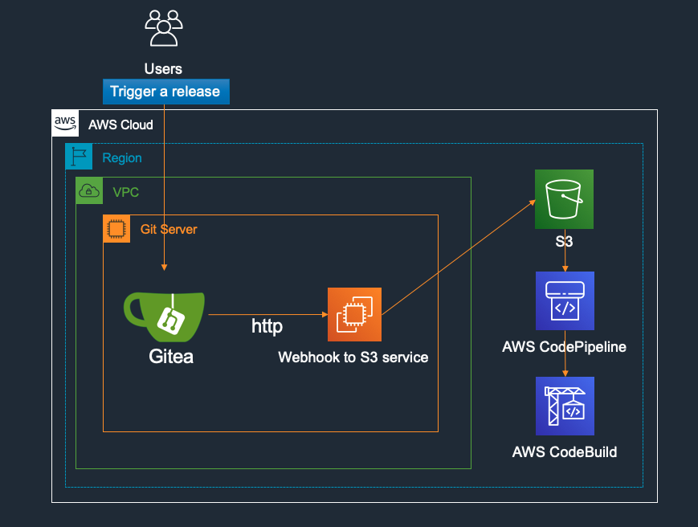
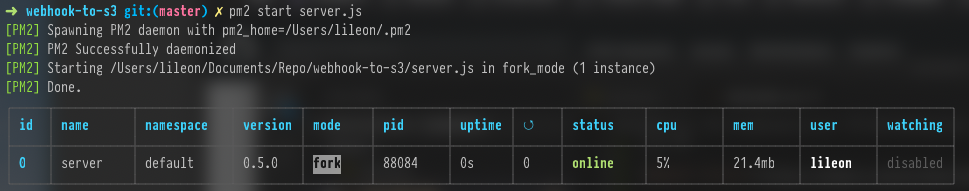
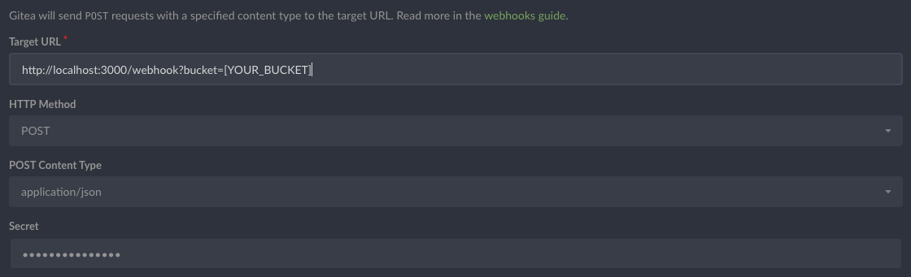
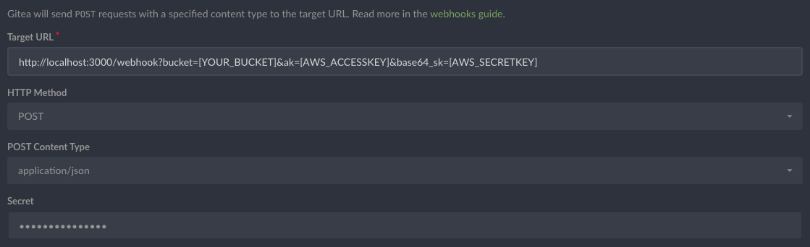

# webhook-to-s3

webhook-too-s3 provides a solution by using a HTTP service to be deployed along with Gitea or any other git server for the Webhook API call integration, the servcie shall securely fetch the code repo from Gitea API and automatically zip and upload the source artifact to a configurable S3 bucket, to enable the integration between the git servers to AWS CodePipeline and AWS CodeBuild.



## Prerequisite
The following Mac or Linux tools should be installed due to the project dependency.
```
nodeJS > v12.15.0
yarn > 1.22.0
curl
zip GNU
```
[NodeJS Install](https://nodejs.org/en/download/)

## Getting Started
After fork/clone the repo, install nodejs dependencies.
```
sudo npm install -g yarn
```
```
cd webhook-to-s3 && yarn install
```
Start the server on console
```
yarn start
```

Or you can manage the node process in production environment by using [pm2](https://github.com/Unitech/pm2) (the npm package process management tool).
```
yarn global add pm2
```
```
pm2 start server.js
```


tail the pm2 logs
```
pm2 logs
```
Or you can just simplely run in docker.
```
docker run -d -p 3000:3000 -e WEBHOOK_SECRET=xxxx -e API_TOKEN=xxxx awsrun/webhook-to-s3:0.8.0
```

## Configurations 
The git webhook shall send a secret to the server, so before `yarn start`, we need to inject the secrect by using environment variable `WEBHOOK_SECRET` and a generated Gitea API token has to be injected to the process to allow the webhook server to `curl` released archive file, the environment variable is `API_TOKEN`.
``` bash
WEBHOOK_SECRET=your_secret_for_webhook_config] API_TOKEN=[your_generated_Gitea_API_token] yarn start
```
or in production environment by using pm2
``` bash
WEBHOOK_SECRET=[your_secret_for_webhook_config] API_TOKEN=[your_generated_Gitea_API_token] pm2 start server.js
```

The Gitea Webhook config is simple, just fill in the form and remember to match the field `secret` to `WEBHOOK_SECRET` and the url param `bucket` is required to be automatically uploading your repo archive to the S3 bucket, and the example s3 key in the bucket would be like `leon/helloworld.zip`, you should use this partten to config your AWS CodePipeline or AWS CodeBuild.



By default the webhook to s3 server shall use your assigned role for the archive upload to the bucket, however you can optionally assign a `ACCESSKEY` and `SECRETKEY` to the post form so that the webhook to s3 server shall help you do even across account uploading for your AWS CodePipeline/CodeBuild integration.



## Conclution
Please be noted this repo is designed to be triggered by `release` action only.
Given an example IAM Role/AKSK policy here.
```
{
    "Version": "2012-10-17",
    "Statement": [
        {
            "Sid": "example",
            "Effect": "Allow",
            "Action": "s3:PutObject",
            "Resource": "[YOUR BUCKET/KEYS]"
        }
    ]
}
```

# License
webhook-to-s3 is open-source software distributed under the terms of the [Apache 2.0](LICENSE) license.


